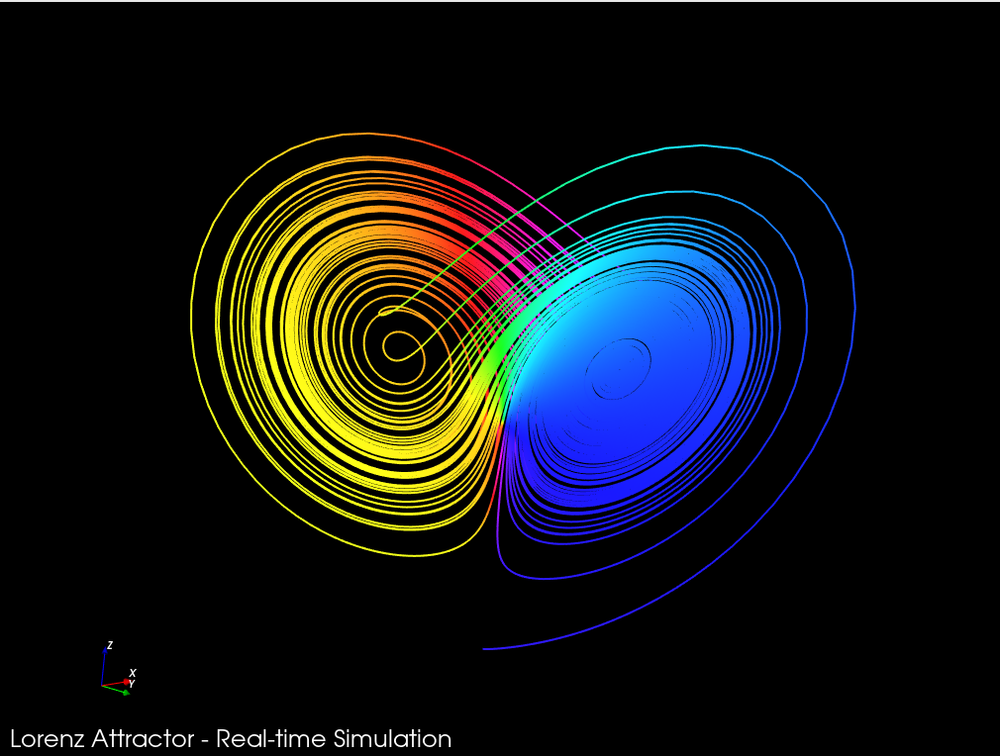

# Lorenz Attractor

Real-time VTK visualization of the Lorenz attractor with a smooth rainbow coloring and interactive camera.



## Quick start

**Dependencies**

- CMake ≥ 3.12
- A C++17 compiler (GCC/Clang/MSVC)
- VTK 9 with rendering + interaction modules

Install VTK on Debian/Ubuntu:

```bash
sudo apt-get install libvtk9-dev
```

**Build**

```bash
cmake -S . -B build
cmake --build build
```

**Run**

```bash
./build/lorenz [nb_iterations] [timer_ms] [time_step] [x0 y0 z0]
```

Defaults: `nb_iterations=10000`, `timer_ms=1`, `time_step=0.01`, `x0=y0=z0=1`.

## License

MIT — see [`LICENSE`](./LICENSE).
